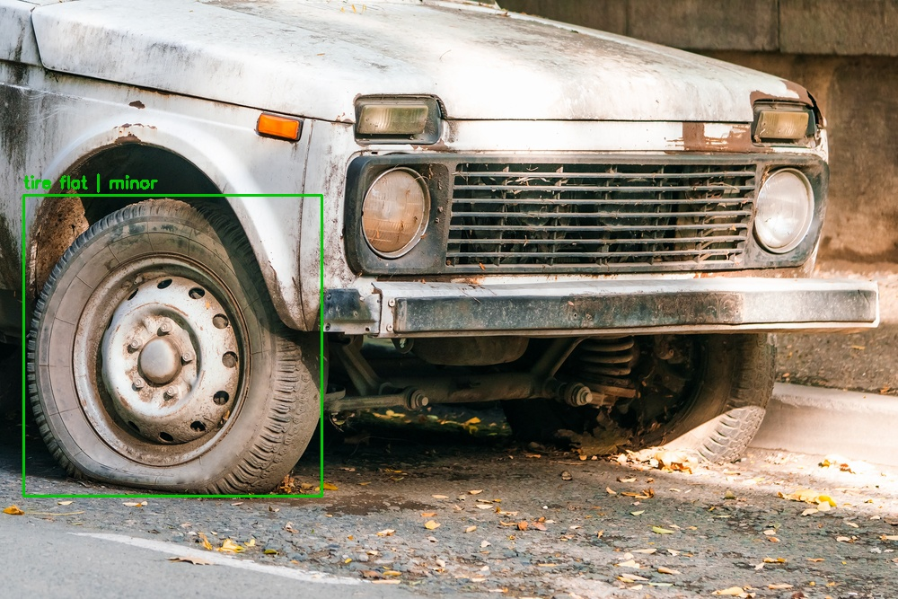

# Vehicle Damage Detection & Severity Assessment

A two-stage computer-vision pipeline that takes a photo of a damaged vehicle and
returns **what** is damaged and **how badly** — designed for use cases like
automated insurance triage and used-car inspection.

```
 input image ──▶ YOLOv8 detector ──▶ damage regions ──▶ crop each region
                                                              │
                                                              ▼
 annotated output ◀── draw box + label ◀── MobileNetV2 severity classifier
   "scratch | minor"                          (minor / moderate / severe)
```



*The pipeline on a test image — each detected region is boxed and labelled with
its damage type and predicted severity.*

## Why two stages?

Detection and severity are different problems. A YOLO detector is excellent at
*localizing and classifying* damage types but says nothing about how serious each
instance is. So Stage 1 finds and labels every damage region; Stage 2 crops each
region and runs a dedicated classifier that judges severity. Decoupling them lets
each model specialize and keeps the severity labels (which require human judgment)
on a small, focused set of crops rather than the full image.

## Dataset

[**CarDD**](https://cardd-ustc.github.io/) — Car Damage Detection dataset, converted
to YOLO format.

| Split | Images |
|-------|-------:|
| Train | 2,816 |
| Val   |   810 |
| Test  |   374 |

**6 damage classes:** dent, scratch, crack, glass shatter, lamp broken, tire flat.

**Severity labels:** a curated set of ~195 cropped damage regions hand-sorted into
`minor / moderate / severe`.

## Results

Trained on a free Colab T4 GPU. All numbers are on held-out data.

**Stage 1 — YOLOv8n detector (test set, 374 images)**

| Metric | Value |
|--------|-------|
| mAP@50 | **0.707** |
| mAP@50-95 | 0.548 |
| Precision | 0.70 |
| Recall | 0.67 |

Per-class mAP@50 — the model is strongest on structured damage and weakest on
diffuse damage, as expected:

| Class | mAP@50 | | Class | mAP@50 |
|-------|--------|---|-------|--------|
| glass shatter | 0.99 | | dent | 0.56 |
| tire flat | 0.95 | | scratch | 0.56 |
| lamp broken | 0.87 | | crack | 0.32 |

**Stage 2 — MobileNetV2 severity classifier (stratified val set, 39 crops)**

| Metric | Value |
|--------|-------|
| Accuracy | **0.769** |
| Recall — minor / moderate / severe | 0.83 / 0.89 / 0.67 |

Confusion matrix (rows = true, cols = predicted):

```
           minor  moderate  severe
minor   [   10       2        0  ]
moderate[    0       8        1  ]
severe  [    0       6       12  ]
```

Errors concentrate on the severe↔moderate boundary — the most subjective
distinction — rather than collapsing to a single class.

## How to run

Training needs a GPU — use a **free Colab T4 runtime**. Inference (the demo) runs on CPU.

Open [`kaggle/colab_kaggle_pipeline.ipynb`](kaggle/colab_kaggle_pipeline.ipynb) in Colab
and run the cells in order. It pulls the CarDD dataset straight from Kaggle (no large
upload), so you only supply a Kaggle API token and a ~22 MB bundle of the hand-labeled
crops + weights. The cells:

1. set the Kaggle token and download the dataset (2,816 / 810 / 374 images),
2. validate the detector, then train a 6-class YOLOv8n detector,
3. train the MobileNetV2 severity classifier on the hand-labeled crops,
4. report a confusion matrix + per-class recall, and run the end-to-end demo.

The three `kaggle/1_*.py` … `3_*.py` scripts are the same stages as standalone,
modular files (train detector → train severity → run the pipeline demo).

### Severity labels

Severity (minor / moderate / severe) is judged per damage crop by a MobileNetV2
classifier. The labels are ~195 hand-sorted crops — small, so the classifier uses a
**frozen ImageNet backbone + augmentation + class weighting**, and is evaluated on a
**stratified** split (every class present in validation) with a confusion matrix, so the
reported accuracy reflects real per-class performance rather than a majority-class bias.

`kaggle/data.yaml` holds the corrected 6-class config. On Colab/Kaggle, set its `path:`
to your dataset directory.

## Project journey (week by week)

This project grew out of a structured applied-ML course that built up from Python
fundamentals to the end-to-end pipeline above. The weekly notebooks are kept in the
repo (`week 0`–`week5`) as a learning record; the production pipeline lives in `kaggle/`.

### Week 0 — Python & data-science foundations
Python basics, then NumPy / Pandas / Matplotlib for data handling and visualization.
Capstone: **K-Means clustering implemented from scratch** in NumPy (random init →
distance → assignment → centroid update → convergence), visualized on 2D coordinate data.

### Week 1 — Supervised learning: linear & logistic regression
Implemented **linear regression from scratch** (weight/bias init, L2 loss, gradient
descent) to predict car resale price, and **logistic regression from scratch** (sigmoid,
binary cross-entropy) for classification. Also explored a **genetic-algorithm-based
regression** as an alternative to gradient descent. Built intuition for optimization,
learning-rate effects, and feature preprocessing.

### Week 2 — Dimensionality reduction: PCA & t-SNE
On scikit-learn's `load_digits` (8×8 handwritten digits, 64-D): applied **PCA** (linear,
preserves global variance) and **t-SNE** (non-linear, preserves local neighborhood
structure), comparing how each separates digit clusters in 2D. Covered the curse of
dimensionality and when to reach for each method.

### Week 3 — Feature extraction, embeddings & detection
Three complementary approaches to representing images: **HOG** handcrafted
edge-gradient features; **CNN embeddings** (train a small CNN, drop the classifier head,
extract dense vectors) visualized with PCA/t-SNE; and **pretrained YOLOv8 inference**
for object detection. Showed why learned features beat handcrafted ones on complex data.

### Week 4 — Dataset understanding & preparation
Studied the **CarDD** dataset in YOLO format — verified train/val/test splits,
image-label correspondence, class IDs, and bounding-box normalization. Key lesson that
proved central later: **image-label mismatch causes silent training failures** (a
mislabeled class config produced zero mAP — the bug fixed in this project).

### Week 5 — End-to-end severity pipeline (this project)
Integrated the trained **YOLOv8 detector** with a **MobileNetV2 severity classifier**
and a human-in-the-loop labeling workflow into the two-stage pipeline documented above.
Emphasis on pipeline design, transfer learning on a small labeled set, and **honest
evaluation** (stratified split + confusion matrix) over headline accuracy.

## Tech stack

Python · NumPy · Pandas · Matplotlib · scikit-learn · scikit-image (HOG) ·
OpenCV · TensorFlow / Keras · MobileNetV2 transfer learning · Ultralytics YOLOv8.
